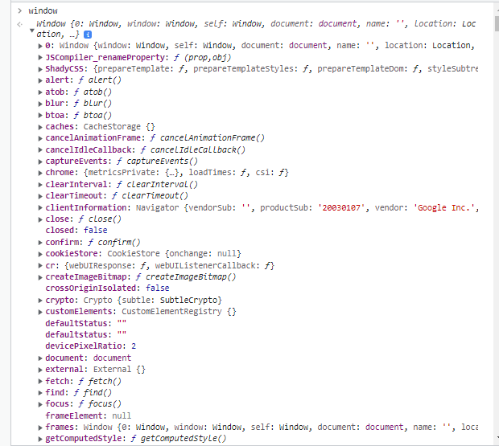
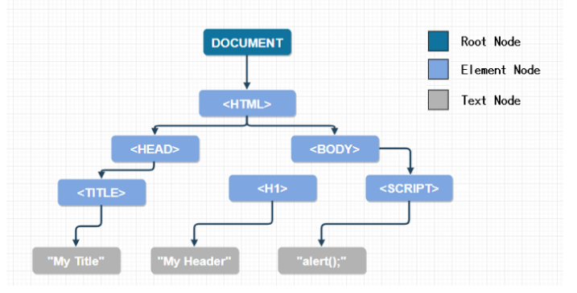
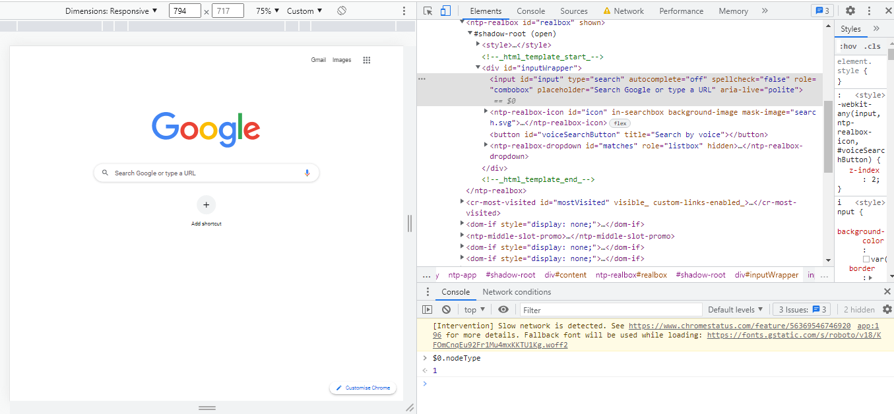

### DOM Manipulation

#### Reference: https://medium.com/swlh/javascript-interview-questions-the-dom-aac267bef799

#### Q1. What is the difference between window and document object
#### A1: Document is part of window object. Window is a global object. It represents browser's window. All global JS objects, methods, variables, location, history, setTimeout , XMLHttpRequest , console , localStorage and much more. become part of window object. Document repesents DOM of the page. DOM is nothing but the HTML generated for each page


##### Good to know

* There are some useful properties and methods related to window size and to modify window
    * Window Size
        * window.innerWidth - this property denotes inner width of browser window in pixels
        * window.innerHeight = this property denotes inner height of browser window in pixels
    * Note: Browser window(or viewport) does not include toolbars and scrollbars

    * Window methods
        * window.open() - opens a new window
        * window.close()- closes current window
        * window.moveTo() - move the current window
        * window.resizeTo() - resize the current window

#### Q2. How do you know visitor's screen width
#### A2. Using screen peroperty of window object
    * screen.width - The screen.width property returns the width of the visitor's screen in pixels.
    * screen.height - The screen.height property returns the width of the visitor's screen in pixels.
    * screen.availWidth - This property returns the width of the visitor's screen, in pixels, minus interface features like the Windows Taskbar.
    * screen.availHeight - The screen.availHeight property returns the height of the visitor's screen, in pixels, minus interface features like the Windows Taskbar.
    * screen.colorDepth - specifies the number of bits used to display one color
        -- All modern computers use 24 bit or 32 bit hardware for color resolution:

        24 bits =      16,777,216 different "True Colors"
        32 bits = 4,294,967,296 different "Deep Colors"

#### Q3. Difference between attribute and property?
#### A3. To understand this, we know that HTML is a standard language to create documents to be displayed on browsers.
DOM(Document object model) is generated when HTML parsing is done by the browser and hence corresponding DOM node is created.
In simple words, to access HTML properties are accessed through this node object.

#### Attributes are defined by HTML and are used to customise a tag. The value is constant
#### Properties belong to DOM. Values can be variable
#### Note: If an attribute is changed, the value of the property will change. On the other hand, if we change the property in the JavaScript DOM object, the attribute will stay the same.

#### Q4. What are the methods to get one or more elements from the DOM?
#### A4.
        i) getElementById - returns element with given ID
        ii) getElementByClassName - returns a NodeList array-like object which has elements with given className
        iii) getElementByTagName - returns a NodeList array-like object which has elements with given tag name
        iv) querySelector - gets a DOM node with specified selected string
        v) querySelectorByAll - gets NodeList matching selector string
        vi) getElementsByName - returns a list of elements ith the name given by HTML 
        vii) getElementByTagNameNS - getElementsByTagNameNS returns elements with a particular tag name within the provided namespace.

#### Q5. What is the fastest way to query DOM?
#### A5. If we searching single element, then serach is faster. So 'getElementByID' will be quickest(Since ID is unique) if ID exists, followed by 'getElementByClassName', then querySelectorAll will be the slowest since it has to search for all kinds of CSS selectors.

#### Q6. How do we use forEach and other array methods on a NodeList?
#### A6. 
    
        [...document.querySelector('div').forEach(div => console.log(div.textContent))]

#### Q7. Write custo emthod for getElementvByAttribute
#### A. 
```
<h1 id="name">HEY<h1>
<h1>H1<h1>
<h1>H2<h1>
const getElementsByAttribute = (attribute, value) => {
  return [...document.querySelectorAll(`[${attribute}=${value}]`)];
}
```

console.log(getElementsByAttribute('id',"name"))
//Array with h1 with id = 'name' is printed

#### Q8. How to add class to HTML element
#### A8.


```
<div id="name">Hi1</div>
<div>Hi2</div>
<div>Hi3</div>
<input type="text" value="hi" />
    
const addClass = (selector, className) => {
  const elm = document.querySelector(selector);
  if (elm) {
    elm.classList.add(className);
  }
};

addClass('input', 'my-input');
const v = document.getElementByClassName('my-input').value;

console.log(v);
```

#### Q9. DOM tree and nodes
#### A9. The document object is the root of every node in the DOM. 


The HTML document is divided into nodes
* element nodes(HTML elements)
* text nodes(text content of element)
* commented codes(commented lines)
every node has nodeType which is a constant value.

Node Type	Value	Example
ELEMENT_NODE	1	The <body> element
TEXT_NODE	3	Text that is not part of an element
COMMENT_NODE	8	<!-- an HTML comment -->

* In the browser dev tools, select any element. Active element is shown with $0. Try consoling the nodeType of $0
    * $0.nodeType - gives 1 if it is an HTML element
  
