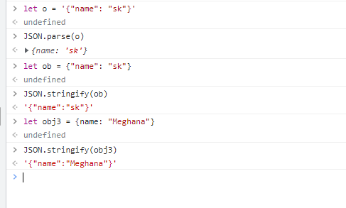
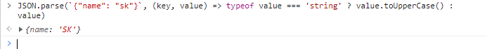
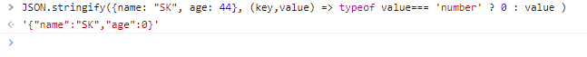
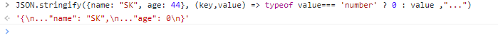

#### Q. Difference between JSON object and Javascript object

#### A. Javascript object notation(JSON) is a light weight data interchange format / text format which makes data exchange faster between clients and servers
* It is based on subset of Javascript programming language ECMA-262 3rd Edition - December 1999.

*  It is easy for humans to read and write. It is easy for machines to parse and generate.
*  JSON is language independent
*  JSON is built on two structures:

    `1. A collection of name/value pairs. In various languages, this is realized as an object, record, struct, dictionary, hash table, keyed list, or associative array.
    2. An ordered list of values. In most languages, this is realized as an array, vector, list, or sequence.`

`Analogy: In excel header with cell data. In forms, label with values. All of these are key value pairs`

#### Two useful methods of JSON

1. JSON.parse() - Takes JSON string and converts to Javascript object. parse() can take second argument which can transform the object and then returned
   
3. JSON.stringify() - Takes Javascript object and converts it to JSON string. It accepts 3 parameters. One is object, replacer and space(to insert whitespace to make code readable)
   
   

Read more here: https://www.json.org/json-en.html

#### Difference between JSON and Javascript object
* Trailing comma is invalid in JSON
* undefined, Functions, and Symbols, NaN, Infinity are not valid JSON values. They are converted to null automatically
* key value pairs are strings